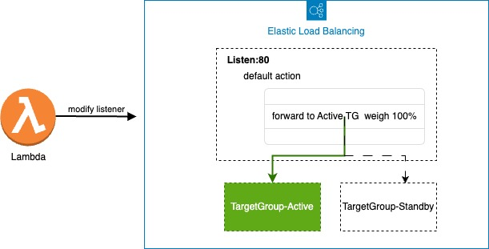

# 通过Lambda实现ALB监听器目标组修改

## 逻辑摘要

在该函数中，我们使用了com.amazonaws.services.elasticloadbalancingv2包中的类和方法来创建Elastic Load Balancing客户端，并使用ModifyListenerRequest方法修改action的配置，将Slave的Targetgroup修改为默认转发的目标。

示意图：



您只要监听器配置一个默认的Action，并转发到Active targetgroup , 当Active targetgroup不可用是将Standby targetgroup配置为默认的转发的目标

## 函数开发与部署

通过SAM框架进行编译

### 1. 安装 sam

```bash
 curl -OL https://github.com/aws/aws-sam-cli/releases/latest/download/aws-sam-cli-linux-x86_64.zip
 unzip aws-sam-cli-linux-x86_64.zip -d sam-installation
 sudo ./sam-installation/install
 
 #verify sam version
 sam --version
```

### 2. 部署 Lambda with SAM

```bash
sam build
sam deploy --guided # input your configuration
```

### 3. 给Lambda授权执行ELB角色所需要的策略

```
{
    "Version": "2012-10-17",
    "Statement": [
        {
            "Sid": "VisualEditor0",
            "Effect": "Allow",
            "Action": [
                "elasticloadbalancing:DescribeLoadBalancers",
                "elasticloadbalancing:ModifyListener",
                "elasticloadbalancing:DescribeListeners",
                "elasticloadbalancing:DescribeTags",
                "elasticloadbalancing:RegisterTargets",
                "elasticloadbalancing:ModifyRule",
                "elasticloadbalancing:ModifyTargetGroup"
            ],
            "Resource": "*"
        }
    ]
}
```

## 监控ALB并事件触发执行Lambda

通过获取到的监控指标输出对应的实践，可以通过cloudwatch创建告警

1. 在cloudwatch创建Alert
2. 选择对应的指标，AWS命名空间选择ApplicationELB
3. 选择指标，您可以配置5XX类的返回表示服务不可用，这边我们用HTTPCode_ELB_502_Count
4. 配置指标触发的条件如窗口期的502异常数量
